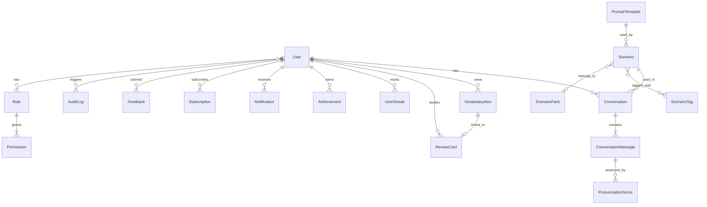
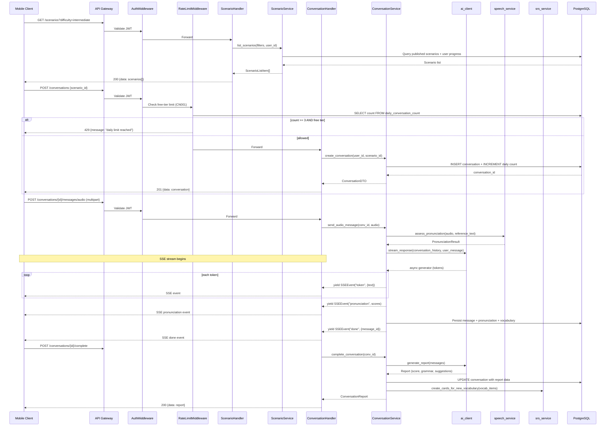
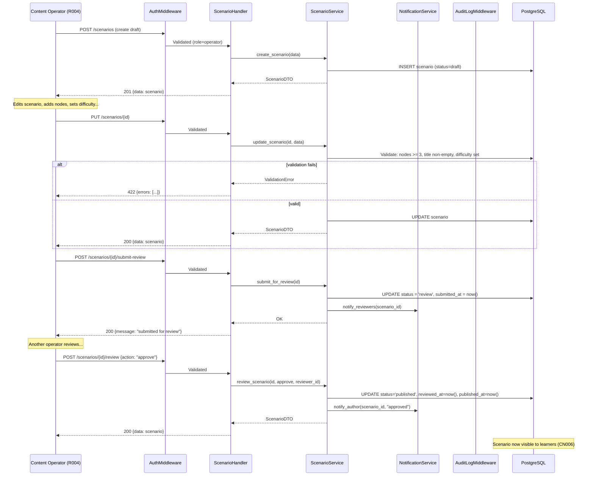

# Design -- api-backend (sp-001)

> Sub-project: **api-backend** | Stack: FastAPI + SQLAlchemy + PostgreSQL
>
> Architecture: three-layer (handlers -> services -> repositories)
>
> Port: 8000 | Auth: JWT | Async: native

---

## 1. Coding Principles

### 1.1 Universal Principles

| # | Principle | Enforcement |
|---|-----------|-------------|
| U1 | Same scenario, same pattern -- T002/T004 share `ai_client`, T005/T006 share `speech_service` | Code review |
| U2 | One shared utility layer -- HTTP client, error handler, logger, date utils | Single `core/` package |
| U3 | Prefer mature third-party libraries (`py-fsrs`, `tenacity`, `pydantic`) | Dependency review |
| U4 | Every external service wrapped in a dedicated service; business layer never imports SDK directly | Architecture lint |

### 1.2 Project-Specific Principles

| # | Spike | Principle |
|---|-------|-----------|
| PS1 | TS001 | All AI calls through `services/ai_client.py`; streaming via async generator + SSE; every call runs through content-filter middleware |
| PS2 | TS001 | Conversation history compression: auto-summarize after N turns to avoid token overflow |
| PS3 | TS002 | Speech assessment through `services/speech_service.py`; mobile clients never call Azure SDK directly (FastAPI proxy) |
| PS4 | TS002 | Speech call failure -> fallback to text input mode; never block user flow |
| PS5 | TS003 | Subscription status source-of-truth = RevenueCat Webhook callback; client status is display cache only |
| PS6 | TS003 | All payment write operations must pass through audit-log middleware (CN005) |
| PS7 | TS004 | Spaced repetition via `services/srs_service.py` wrapping FSRS; business layer only passes `(card_id, rating)` |
| PS8 | CN001 | Free-tier conversation limit (3/day) enforced in middleware, not business logic |
| PS9 | CN002 | Refund validation: backend hard-checks cumulative refund <= original payment; prevent concurrent over-refund |
| PS10 | CN006 | Scenario content requires approval workflow before becoming visible to learners |

_Source: forge-decisions.coding_principles_

---

## 2. Third-Party Integrations

| ID | Category | Vendor | SDK / Package | Service Wrapper | Usage |
|----|----------|--------|---------------|-----------------|-------|
| TS001 | AI/LLM | OpenAI | `openai` + `langchain` | `services/ai_client.py` | Conversation AI, report generation, recommendations. SSE streaming. |
| TS002 | Speech | Azure | `azure-cognitiveservices-speech-sdk` | `services/speech_service.py` | STT, TTS, phoneme-level pronunciation assessment. FastAPI proxy. |
| TS003 | Payment | RevenueCat | Webhook receiver | `services/subscription_service.py` | Subscription status sync via webhook. No direct SDK call from backend. |
| TS004 | Algorithm | FSRS | `py-fsrs` | `services/srs_service.py` | Spaced repetition scheduling. |
| TS005 | Realtime | FastAPI | Built-in SSE/WebSocket | `handlers/` SSE endpoints | AI streaming responses. |
| TS006 | Push | Expo | HTTP API | `services/push_service.py` | Review reminders, system notifications. |

_Source: forge-decisions.technical_spikes_

---

## 3. Data Model

### 3.1 ER Diagram



### 3.2 Entity Definitions

#### User

| Field | Type | Constraints | Notes |
|-------|------|-------------|-------|
| id | UUID | PK | |
| email | VARCHAR(255) | UNIQUE, NOT NULL | Login identifier |
| phone | VARCHAR(20) | UNIQUE, NULLABLE | Optional login |
| password_hash | VARCHAR(255) | NOT NULL | bcrypt |
| display_name | VARCHAR(100) | NOT NULL | |
| avatar_url | VARCHAR(512) | NULLABLE | |
| native_language | VARCHAR(10) | DEFAULT 'zh-CN' | |
| english_level | ENUM(beginner,intermediate,advanced) | DEFAULT 'beginner' | |
| learning_goal | VARCHAR(255) | NULLABLE | |
| is_active | BOOLEAN | DEFAULT true | Soft-delete flag. _Source: CN003_ |
| is_banned | BOOLEAN | DEFAULT false | _Source: CN008_ |
| ban_reason | TEXT | NULLABLE | |
| deactivated_at | TIMESTAMP | NULLABLE | For 30-day retention. _Source: CN003_ |
| subscription_tier | ENUM(free,premium,pro) | DEFAULT 'free' | Cache from RevenueCat. _Source: TS003_ |
| expo_push_token | VARCHAR(255) | NULLABLE | _Source: TS006_ |
| created_at | TIMESTAMP | NOT NULL, DEFAULT now() | |
| updated_at | TIMESTAMP | NOT NULL, auto-update | |

**Indexes**: `idx_user_email` (UNIQUE), `idx_user_phone` (UNIQUE), `idx_user_active` (is_active, is_banned)

---

#### Role

| Field | Type | Constraints | Notes |
|-------|------|-------------|-------|
| id | UUID | PK | |
| name | VARCHAR(50) | UNIQUE, NOT NULL | e.g. consumer, operator, admin |
| description | VARCHAR(255) | NULLABLE | |
| created_at | TIMESTAMP | NOT NULL | |

---

#### Permission

| Field | Type | Constraints | Notes |
|-------|------|-------------|-------|
| id | UUID | PK | |
| role_id | UUID | FK -> Role | |
| resource | VARCHAR(100) | NOT NULL | e.g. "scenarios", "users" |
| action | VARCHAR(50) | NOT NULL | e.g. "read", "write", "delete" |

**Indexes**: `idx_perm_role` (role_id), UNIQUE(role_id, resource, action)

---

#### UserRole (join table)

| Field | Type | Constraints |
|-------|------|-------------|
| user_id | UUID | FK -> User, PK |
| role_id | UUID | FK -> Role, PK |
| assigned_at | TIMESTAMP | NOT NULL |

---

#### Scenario

| Field | Type | Constraints | Notes |
|-------|------|-------------|-------|
| id | UUID | PK | |
| title | VARCHAR(200) | NOT NULL | _Source: T009.rules_ |
| description | TEXT | NULLABLE | |
| difficulty | ENUM(beginner,intermediate,advanced) | NOT NULL | _Source: T009.rules_ |
| target_roles | JSONB | DEFAULT '[]' | e.g. ["R001","R003"] |
| dialogue_nodes | JSONB | NOT NULL | Array of {seq, role, content, hints} |
| status | ENUM(draft,review,published,rejected,archived) | DEFAULT 'draft' | _Source: CN006_ |
| rejection_reason | TEXT | NULLABLE | _Source: T010.rules_ |
| prompt_template_id | UUID | FK -> PromptTemplate, NULLABLE | |
| pack_id | UUID | FK -> ScenarioPack, NULLABLE | |
| author_id | UUID | FK -> User | Creator (R004) |
| reviewer_id | UUID | FK -> User, NULLABLE | |
| reviewed_at | TIMESTAMP | NULLABLE | |
| submitted_at | TIMESTAMP | NULLABLE | When submitted for review |
| published_at | TIMESTAMP | NULLABLE | |
| created_at | TIMESTAMP | NOT NULL | |
| updated_at | TIMESTAMP | NOT NULL | |

**Indexes**: `idx_scenario_status` (status), `idx_scenario_difficulty` (difficulty), `idx_scenario_author` (author_id), `idx_scenario_pack` (pack_id)

**Constraint**: `dialogue_nodes` array length >= 3 (validated at service layer). _Source: T009.rules_

**State Machine**: draft -> review -> published | rejected. rejected -> draft (re-edit). published -> archived. _Source: CN006_

---

#### ScenarioPack

| Field | Type | Constraints | Notes |
|-------|------|-------------|-------|
| id | UUID | PK | |
| name | VARCHAR(200) | NOT NULL | |
| description | TEXT | NULLABLE | |
| cover_image_url | VARCHAR(512) | NULLABLE | |
| price_cents | INTEGER | DEFAULT 0 | 0 = free |
| is_published | BOOLEAN | DEFAULT false | |
| created_at | TIMESTAMP | NOT NULL | |
| updated_at | TIMESTAMP | NOT NULL | |

---

#### ScenarioTag

| Field | Type | Constraints | Notes |
|-------|------|-------------|-------|
| id | UUID | PK | |
| name | VARCHAR(100) | UNIQUE, NOT NULL | |
| category | VARCHAR(50) | NULLABLE | e.g. topic, industry, skill |
| created_at | TIMESTAMP | NOT NULL | |

---

#### ScenarioTagMap (join table)

| Field | Type | Constraints |
|-------|------|-------------|
| scenario_id | UUID | FK -> Scenario, PK |
| tag_id | UUID | FK -> ScenarioTag, PK |

---

#### Conversation

| Field | Type | Constraints | Notes |
|-------|------|-------------|-------|
| id | UUID | PK | |
| user_id | UUID | FK -> User, NOT NULL | |
| scenario_id | UUID | FK -> Scenario, NULLABLE | NULL for free-form (DEFER T004) |
| status | ENUM(active,completed,abandoned) | DEFAULT 'active' | |
| overall_score | FLOAT | NULLABLE | AI-generated. _Source: T003_ |
| grammar_errors | JSONB | NULLABLE | [{text, correction, explanation}] |
| expression_suggestions | JSONB | NULLABLE | [{original, suggested, reason}] |
| duration_seconds | INTEGER | NULLABLE | |
| message_count | INTEGER | DEFAULT 0 | |
| word_count | INTEGER | DEFAULT 0 | |
| started_at | TIMESTAMP | NOT NULL | |
| completed_at | TIMESTAMP | NULLABLE | |
| created_at | TIMESTAMP | NOT NULL | |

**Indexes**: `idx_conv_user` (user_id), `idx_conv_user_date` (user_id, created_at), `idx_conv_scenario` (scenario_id), `idx_conv_status` (status)

---

#### ConversationMessage

| Field | Type | Constraints | Notes |
|-------|------|-------------|-------|
| id | UUID | PK | |
| conversation_id | UUID | FK -> Conversation, NOT NULL | |
| role | ENUM(user,ai,system) | NOT NULL | |
| content | TEXT | NOT NULL | |
| audio_url | VARCHAR(512) | NULLABLE | S3/GCS URL for voice input |
| token_count | INTEGER | NULLABLE | For cost tracking |
| sequence | INTEGER | NOT NULL | Order within conversation |
| created_at | TIMESTAMP | NOT NULL | |

**Indexes**: `idx_msg_conv_seq` (conversation_id, sequence)

---

#### PronunciationScore

| Field | Type | Constraints | Notes |
|-------|------|-------------|-------|
| id | UUID | PK | |
| message_id | UUID | FK -> ConversationMessage, NOT NULL | |
| user_id | UUID | FK -> User, NOT NULL | Denormalized for queries |
| accuracy_score | FLOAT | NOT NULL, CHECK(0.0-1.0) | _Source: CN007_ |
| fluency_score | FLOAT | NOT NULL, CHECK(0.0-1.0) | |
| completeness_score | FLOAT | NOT NULL, CHECK(0.0-1.0) | |
| prosody_score | FLOAT | NULLABLE, CHECK(0.0-1.0) | en-US only. _Source: TS002_ |
| phoneme_details | JSONB | NULLABLE | [{phoneme, score, is_correct}] |
| reference_text | TEXT | NULLABLE | Expected text |
| created_at | TIMESTAMP | NOT NULL | |

**Indexes**: `idx_pron_user` (user_id), `idx_pron_message` (message_id)

---

#### VocabularyItem

| Field | Type | Constraints | Notes |
|-------|------|-------------|-------|
| id | UUID | PK | |
| user_id | UUID | FK -> User, NOT NULL | |
| word | VARCHAR(200) | NOT NULL | |
| definition | TEXT | NULLABLE | |
| example_sentence | TEXT | NULLABLE | |
| source_conversation_id | UUID | FK -> Conversation, NULLABLE | |
| source_type | ENUM(auto_collected,manual) | DEFAULT 'auto_collected' | _Source: T002.rules_ |
| mastery_level | ENUM(new,learning,mastered) | DEFAULT 'new' | |
| created_at | TIMESTAMP | NOT NULL | |
| updated_at | TIMESTAMP | NOT NULL | |

**Indexes**: `idx_vocab_user` (user_id), `idx_vocab_user_word` UNIQUE (user_id, word)

---

#### ReviewCard

| Field | Type | Constraints | Notes |
|-------|------|-------------|-------|
| id | UUID | PK | |
| user_id | UUID | FK -> User, NOT NULL | |
| vocabulary_id | UUID | FK -> VocabularyItem, NOT NULL | |
| stability | FLOAT | NOT NULL | FSRS parameter. _Source: TS004_ |
| difficulty | FLOAT | NOT NULL | FSRS parameter |
| elapsed_days | INTEGER | NOT NULL | |
| scheduled_days | INTEGER | NOT NULL | |
| reps | INTEGER | DEFAULT 0 | |
| lapses | INTEGER | DEFAULT 0 | |
| state | ENUM(new,learning,review,relearning) | DEFAULT 'new' | FSRS state |
| due | TIMESTAMP | NOT NULL | Next review date |
| last_review | TIMESTAMP | NULLABLE | |
| created_at | TIMESTAMP | NOT NULL | |
| updated_at | TIMESTAMP | NOT NULL | |

**Indexes**: `idx_review_user_due` (user_id, due), `idx_review_vocab` (vocabulary_id)

---

#### UserStreak

| Field | Type | Constraints | Notes |
|-------|------|-------------|-------|
| id | UUID | PK | |
| user_id | UUID | FK -> User, UNIQUE | One active record per user |
| current_streak | INTEGER | DEFAULT 0 | |
| longest_streak | INTEGER | DEFAULT 0 | |
| last_active_date | DATE | NOT NULL | |
| restorations_this_month | INTEGER | DEFAULT 0 | _Source: CN004_ |
| restoration_month | DATE | NOT NULL | First day of current month |
| created_at | TIMESTAMP | NOT NULL | |
| updated_at | TIMESTAMP | NOT NULL | |

**Indexes**: `idx_streak_user` UNIQUE (user_id)

---

#### Achievement

| Field | Type | Constraints | Notes |
|-------|------|-------------|-------|
| id | UUID | PK | |
| code | VARCHAR(50) | UNIQUE, NOT NULL | e.g. "streak_7", "first_conversation" |
| name | VARCHAR(100) | NOT NULL | |
| description | TEXT | NULLABLE | |
| icon_url | VARCHAR(512) | NULLABLE | |
| criteria | JSONB | NOT NULL | Machine-readable unlock condition |

---

#### UserAchievement (join table)

| Field | Type | Constraints |
|-------|------|-------------|
| user_id | UUID | FK -> User, PK |
| achievement_id | UUID | FK -> Achievement, PK |
| earned_at | TIMESTAMP | NOT NULL |

---

#### Subscription

| Field | Type | Constraints | Notes |
|-------|------|-------------|-------|
| id | UUID | PK | |
| user_id | UUID | FK -> User, NOT NULL | |
| revenuecat_id | VARCHAR(255) | UNIQUE, NULLABLE | _Source: TS003_ |
| plan | ENUM(free,monthly,yearly) | DEFAULT 'free' | |
| status | ENUM(active,expired,cancelled,trial) | DEFAULT 'active' | |
| started_at | TIMESTAMP | NULLABLE | |
| expires_at | TIMESTAMP | NULLABLE | |
| cancelled_at | TIMESTAMP | NULLABLE | |
| raw_webhook_data | JSONB | NULLABLE | Last webhook payload |
| created_at | TIMESTAMP | NOT NULL | |
| updated_at | TIMESTAMP | NOT NULL | |

**Indexes**: `idx_sub_user` (user_id), `idx_sub_rc` UNIQUE (revenuecat_id)

---

#### AuditLog

| Field | Type | Constraints | Notes |
|-------|------|-------------|-------|
| id | UUID | PK | |
| operator_id | UUID | FK -> User, NULLABLE | NULL for system actions |
| action | VARCHAR(100) | NOT NULL | e.g. "user.ban", "subscription.webhook" |
| target_entity | VARCHAR(100) | NOT NULL | e.g. "User", "Subscription" |
| target_id | UUID | NOT NULL | |
| payload | JSONB | NULLABLE | Request/change snapshot |
| idempotency_key | VARCHAR(255) | NULLABLE | _Source: CN005_ |
| ip_address | VARCHAR(45) | NULLABLE | |
| created_at | TIMESTAMP | NOT NULL | Immutable |

**Indexes**: `idx_audit_target` (target_entity, target_id), `idx_audit_operator` (operator_id), `idx_audit_action` (action), `idx_audit_created` (created_at)

**Note**: Append-only table. No UPDATE/DELETE allowed. _Source: CN005, CN008_

---

#### Notification

| Field | Type | Constraints | Notes |
|-------|------|-------------|-------|
| id | UUID | PK | |
| user_id | UUID | FK -> User, NOT NULL | |
| type | ENUM(review_reminder,system,achievement,escalation) | NOT NULL | |
| title | VARCHAR(200) | NOT NULL | |
| body | TEXT | NOT NULL | |
| is_read | BOOLEAN | DEFAULT false | |
| data | JSONB | NULLABLE | Deep-link payload |
| created_at | TIMESTAMP | NOT NULL | |

**Indexes**: `idx_notif_user_read` (user_id, is_read, created_at DESC)

---

#### Feedback

| Field | Type | Constraints | Notes |
|-------|------|-------------|-------|
| id | UUID | PK | |
| user_id | UUID | FK -> User, NOT NULL | |
| type | ENUM(bug,feature,complaint,other) | NOT NULL | |
| content | TEXT | NOT NULL | _Source: T045.rules_ |
| screenshot_urls | JSONB | DEFAULT '[]' | |
| status | ENUM(pending,in_progress,resolved,closed) | DEFAULT 'pending' | |
| admin_reply | TEXT | NULLABLE | _Source: T037_ |
| resolved_by | UUID | FK -> User, NULLABLE | |
| created_at | TIMESTAMP | NOT NULL | |
| updated_at | TIMESTAMP | NOT NULL | |

**Indexes**: `idx_feedback_user` (user_id), `idx_feedback_status` (status)

---

#### PromptTemplate

| Field | Type | Constraints | Notes |
|-------|------|-------------|-------|
| id | UUID | PK | |
| name | VARCHAR(200) | NOT NULL | |
| description | TEXT | NULLABLE | |
| system_prompt | TEXT | NOT NULL | |
| user_prompt_template | TEXT | NOT NULL | Jinja2-style with variables |
| variables | JSONB | DEFAULT '[]' | Expected template variables |
| version | INTEGER | DEFAULT 1 | |
| is_active | BOOLEAN | DEFAULT false | Only one active per scenario type |
| author_id | UUID | FK -> User | R005 |
| created_at | TIMESTAMP | NOT NULL | |
| updated_at | TIMESTAMP | NOT NULL | |

**Indexes**: `idx_prompt_active` (is_active)

---

#### SystemConfig

| Field | Type | Constraints | Notes |
|-------|------|-------------|-------|
| id | UUID | PK | |
| key | VARCHAR(100) | UNIQUE, NOT NULL | e.g. "free_daily_limit", "round_timeout_sec" |
| value | TEXT | NOT NULL | JSON-encoded value |
| value_type | ENUM(int,float,string,bool,json) | NOT NULL | |
| description | VARCHAR(500) | NULLABLE | |
| updated_by | UUID | FK -> User, NULLABLE | |
| updated_at | TIMESTAMP | NOT NULL | |

---

#### DailyConversationCount (for CN001 enforcement)

| Field | Type | Constraints | Notes |
|-------|------|-------------|-------|
| id | UUID | PK | |
| user_id | UUID | FK -> User, NOT NULL | |
| date | DATE | NOT NULL | |
| count | INTEGER | DEFAULT 0 | |

**Indexes**: `idx_daily_conv_user_date` UNIQUE (user_id, date)

_Source: CN001_

---

## 4. API Endpoints

Base URL: `http://localhost:8000/api/v1`

### 4.1 Auth Module

| Method | Path | Handler | Auth | Description | Source |
|--------|------|---------|------|-------------|--------|
| POST | `/auth/register` | `auth.register` | Public | Register new account | T039 |
| POST | `/auth/login` | `auth.login` | Public | Login, return JWT pair | T039 |
| POST | `/auth/refresh` | `auth.refresh` | Refresh Token | Refresh access token | T039 |
| POST | `/auth/logout` | `auth.logout` | Bearer | Invalidate refresh token | T039 |

**Request/Response DTOs**:

```
RegisterRequest  { email: str, password: str, display_name: str, phone?: str }
LoginRequest     { email: str, password: str }
TokenResponse    { access_token: str, refresh_token: str, expires_in: int, token_type: "bearer" }
```

### 4.2 Scenarios Module

| Method | Path | Handler | Auth | Description | Source |
|--------|------|---------|------|-------------|--------|
| GET | `/scenarios` | `scenario.list` | Bearer(consumer) | List published scenarios with filters | T001 |
| GET | `/scenarios/{id}` | `scenario.get` | Bearer(consumer) | Get scenario detail with user progress | T001 |
| POST | `/scenarios` | `scenario.create` | Bearer(operator) | Create draft scenario | T009 |
| PUT | `/scenarios/{id}` | `scenario.update` | Bearer(operator) | Update draft scenario | T009 |
| POST | `/scenarios/{id}/submit-review` | `scenario.submit_review` | Bearer(operator) | Submit for review (draft->review) | T009, CN006 |
| POST | `/scenarios/{id}/review` | `scenario.review` | Bearer(operator) | Approve or reject | T010, CN006 |
| GET | `/scenarios/review-queue` | `scenario.review_queue` | Bearer(operator) | List pending review scenarios | T010 |

**Request/Response DTOs**:

```
ScenarioListQuery    { difficulty?: str, tag_id?: uuid, role?: str, page: int, size: int }
ScenarioListItem     { id, title, difficulty, tags[], progress?, cover_image_url, avg_score? }
ScenarioDetail       { id, title, description, difficulty, target_roles[], dialogue_nodes[], tags[], status, ... }
ScenarioCreateReq    { title: str, description?: str, difficulty: str, target_roles: str[], dialogue_nodes: json[], tag_ids: uuid[], prompt_template_id?: uuid }
ReviewRequest        { action: "approve" | "reject", reason?: str }  -- reason required if reject
```

### 4.3 Conversations Module

| Method | Path | Handler | Auth | Description | Source |
|--------|------|---------|------|-------------|--------|
| POST | `/conversations` | `conversation.create` | Bearer(consumer) | Start conversation (checks CN001) | T002, CN001 |
| GET | `/conversations/{id}` | `conversation.get` | Bearer(consumer) | Get conversation with messages | T002 |
| POST | `/conversations/{id}/messages` | `conversation.send_message` | Bearer(consumer) | Send text message, receive AI SSE stream | T002, TS001 |
| POST | `/conversations/{id}/messages/audio` | `conversation.send_audio` | Bearer(consumer) | Send audio, get STT + pronunciation + AI response | T002, T005, TS002 |
| POST | `/conversations/{id}/complete` | `conversation.complete` | Bearer(consumer) | End conversation, trigger report | T002, T003 |
| GET | `/conversations/{id}/report` | `conversation.get_report` | Bearer(consumer) | Get conversation report | T003 |
| GET | `/conversations` | `conversation.list` | Bearer(consumer) | List user's conversations | T002 |

**Request/Response DTOs**:

```
CreateConversationReq  { scenario_id: uuid }
SendMessageReq         { content: str }
SendAudioReq           { audio: UploadFile (multipart) }
-- SSE response for send_message and send_audio:
SSEEvent               { event: "token"|"pronunciation"|"vocabulary"|"done", data: json }

ConversationReport     { overall_score, grammar_errors[], expression_suggestions[], pronunciation_summary, duration_seconds, message_count, word_count }
```

**SSE Stream Events** (for `/messages` and `/messages/audio`):

| Event | Data | Description |
|-------|------|-------------|
| `token` | `{ text: str }` | Incremental AI response token |
| `pronunciation` | `{ accuracy, fluency, completeness, prosody?, phonemes[] }` | Pronunciation result (audio only) |
| `vocabulary` | `{ words: [{word, definition}] }` | Detected new vocabulary |
| `done` | `{ message_id: uuid }` | Stream complete |

_Source: T002, T003, T005, TS001, TS002, TS005_

### 4.4 Review (Spaced Repetition) Module

| Method | Path | Handler | Auth | Description | Source |
|--------|------|---------|------|-------------|--------|
| GET | `/reviews/today` | `review.get_today` | Bearer(consumer) | Get today's due review cards | T007 |
| POST | `/reviews/{card_id}/rate` | `review.rate_card` | Bearer(consumer) | Submit rating, FSRS recalculates | T007, TS004 |
| GET | `/reviews/summary` | `review.get_summary` | Bearer(consumer) | Get review session summary | T007 |

**Request/Response DTOs**:

```
ReviewCardDTO        { id, vocabulary: {word, definition, example}, due, state }
RateCardReq          { rating: 1|2|3|4 }  -- 1=again, 2=hard, 3=good, 4=easy
ReviewSummary        { total_due, reviewed, retention_rate, next_due_at }
```

### 4.5 Streaks and Achievements Module

| Method | Path | Handler | Auth | Description | Source |
|--------|------|---------|------|-------------|--------|
| GET | `/streaks/me` | `streak.get_current` | Bearer(consumer) | Get current streak info | T013 |
| POST | `/streaks/restore` | `streak.restore` | Bearer(consumer) | Restore broken streak (CN004) | T013, CN004 |
| GET | `/achievements` | `achievement.list` | Bearer(consumer) | List all achievements with earned status | T013 |

**Request/Response DTOs**:

```
StreakDTO            { current_streak, longest_streak, last_active_date, can_restore: bool }
AchievementDTO       { id, code, name, description, icon_url, earned_at?: datetime }
```

### 4.6 Recommendations Module

| Method | Path | Handler | Auth | Description | Source |
|--------|------|---------|------|-------------|--------|
| GET | `/recommendations` | `recommendation.get` | Bearer(consumer) | Get personalized scenario recommendations | T020 |

**Response DTO**:

```
RecommendationDTO    { scenario: ScenarioListItem, reason: str, score: float }
```

### 4.7 AI Quality Module (Operator)

| Method | Path | Handler | Auth | Description | Source |
|--------|------|---------|------|-------------|--------|
| GET | `/admin/ai-quality/overview` | `ai_quality.overview` | Bearer(operator) | Quality score overview + trends | T029 |
| GET | `/admin/ai-quality/low-score` | `ai_quality.low_score_list` | Bearer(operator) | Low-score conversations | T029 |

**Response DTO**:

```
QualityOverview      { avg_score, score_distribution: {}, trend: [{date, avg_score}] }
```

### 4.8 Metrics Dashboard Module (Operator)

| Method | Path | Handler | Auth | Description | Source |
|--------|------|---------|------|-------------|--------|
| GET | `/admin/metrics/dashboard` | `metrics.dashboard` | Bearer(operator) | DAU/MAU/retention/revenue | T025 |
| POST | `/admin/metrics/alerts` | `metrics.create_alert` | Bearer(operator) | Set metric alert threshold | T025 |

### 4.9 User Management Module (Admin)

| Method | Path | Handler | Auth | Description | Source |
|--------|------|---------|------|-------------|--------|
| GET | `/admin/users` | `user_mgmt.search` | Bearer(admin) | Search users | T033 |
| GET | `/admin/users/{id}` | `user_mgmt.get_detail` | Bearer(admin) | User detail + learning summary | T033 |
| POST | `/admin/users/{id}/ban` | `user_mgmt.ban` | Bearer(admin) | Ban user (requires confirmation) | T033, CN008 |
| POST | `/admin/users/{id}/unban` | `user_mgmt.unban` | Bearer(admin) | Unban user | T033, CN008 |

**Request DTO**:

```
BanUserReq           { reason: str, confirm: bool }  -- confirm must be true, else 400
```

### 4.10 Notifications Module

| Method | Path | Handler | Auth | Description | Source |
|--------|------|---------|------|-------------|--------|
| GET | `/notifications` | `notification.list` | Bearer(consumer) | List notifications | T044 |
| PATCH | `/notifications/{id}/read` | `notification.mark_read` | Bearer(consumer) | Mark as read | T044 |
| PUT | `/notifications/settings` | `notification.update_settings` | Bearer(consumer) | Update push preferences | T044 |

### 4.11 Webhook Receiver

| Method | Path | Handler | Auth | Description | Source |
|--------|------|---------|------|-------------|--------|
| POST | `/webhooks/revenuecat` | `webhook.revenuecat` | Signature verification | RevenueCat subscription events | TS003, CN005 |

### 4.12 System

| Method | Path | Handler | Auth | Description | Source |
|--------|------|---------|------|-------------|--------|
| GET | `/health` | `system.health` | Public | Health check | -- |
| GET | `/docs` | auto-generated | Public | Swagger UI | -- |

---

## 5. Middleware Chain

Request processing order (top to bottom):

```
Request
  |
  v
[1] CORSMiddleware          -- Allow mobile + admin origins
  |
  v
[2] RequestIdMiddleware      -- Inject X-Request-ID for tracing
  |
  v
[3] ErrorHandlerMiddleware   -- Catch all exceptions -> unified error envelope
  |
  v
[4] AuthMiddleware           -- Validate JWT, extract user_id + roles; skip for public routes
  |
  v
[5] RateLimitMiddleware      -- CN001: free-tier 3 conv/day check (only on POST /conversations)
  |
  v
[6] AuditLogMiddleware       -- CN005/CN008: intercept payment + ban endpoints, write AuditLog
  |
  v
[7] Route Handler
```

### Middleware Details

**AuthMiddleware**: Decodes JWT from `Authorization: Bearer <token>`. Sets `request.state.user_id`, `request.state.roles`. Returns 401 for invalid/expired tokens. Skips paths: `/auth/*`, `/health`, `/docs`, `/webhooks/*`.

**RateLimitMiddleware**: On `POST /api/v1/conversations`, queries `DailyConversationCount` for (user_id, today). If `count >= SystemConfig['free_daily_limit']` AND `user.subscription_tier == 'free'`, returns 429. _Source: CN001_

**AuditLogMiddleware**: For configured paths (`/webhooks/revenuecat`, `/admin/users/*/ban`, `/admin/users/*/unban`), captures request body, response status, operator_id, and writes an AuditLog record after handler completes. _Source: CN005, CN008_

---

## 6. Service Architecture (Three-Layer)

```
apps/api-backend/
  app/
    main.py                       -- FastAPI app, middleware registration, router mount
    core/
      config.py                   -- Settings via pydantic-settings (env vars)
      security.py                 -- JWT encode/decode, password hashing
      errors.py                   -- AppError hierarchy, error codes enum
      response.py                 -- Unified response envelope
      deps.py                     -- Dependency injection (get_db, get_current_user)
    middleware/
      auth.py                     -- AuthMiddleware
      rate_limit.py               -- RateLimitMiddleware (CN001)
      audit_log.py                -- AuditLogMiddleware (CN005, CN008)
      error_handler.py            -- ErrorHandlerMiddleware
      request_id.py               -- RequestIdMiddleware
    models/                       -- SQLAlchemy ORM models (1 file per entity)
      base.py                     -- DeclarativeBase, common mixins (TimestampMixin, UUIDMixin)
      user.py
      role.py
      scenario.py
      scenario_pack.py
      scenario_tag.py
      conversation.py
      conversation_message.py
      pronunciation_score.py
      vocabulary_item.py
      review_card.py
      user_streak.py
      achievement.py
      subscription.py
      audit_log.py
      notification.py
      feedback.py
      prompt_template.py
      system_config.py
      daily_conversation_count.py
    schemas/                      -- Pydantic request/response DTOs (1 file per module)
      auth.py
      scenario.py
      conversation.py
      review.py
      streak.py
      recommendation.py
      ai_quality.py
      metrics.py
      user_mgmt.py
      notification.py
      webhook.py
    repositories/                 -- Data access layer (SQLAlchemy queries)
      base.py                     -- GenericRepository[T] with CRUD
      user_repo.py
      scenario_repo.py
      conversation_repo.py
      review_card_repo.py
      streak_repo.py
      achievement_repo.py
      subscription_repo.py
      audit_log_repo.py
      notification_repo.py
      system_config_repo.py
      daily_count_repo.py
    services/                     -- Business logic
      auth_service.py
      scenario_service.py
      conversation_service.py
      report_service.py
      review_service.py
      streak_service.py
      achievement_service.py
      recommendation_service.py
      ai_quality_service.py
      metrics_service.py
      user_mgmt_service.py
      notification_service.py
      subscription_service.py      -- RevenueCat webhook processing
      # External service wrappers (Principle U4):
      ai_client.py                 -- OpenAI/LangChain wrapper (TS001)
      speech_service.py            -- Azure Speech SDK wrapper (TS002)
      srs_service.py               -- FSRS wrapper (TS004)
      push_service.py              -- Expo Push API wrapper (TS006)
    handlers/                     -- FastAPI routers (thin layer, delegates to services)
      auth.py
      scenario.py
      conversation.py
      review.py
      streak.py
      achievement.py
      recommendation.py
      ai_quality.py
      metrics.py
      user_mgmt.py
      notification.py
      webhook.py
      system.py                   -- /health
    migrations/                   -- Alembic
      env.py
      versions/
  tests/
    unit/                         -- Service + repository unit tests
    integration/                  -- API endpoint tests with TestClient
    conftest.py                   -- Fixtures, test DB
  alembic.ini
  pyproject.toml
  Dockerfile
  .env.example
```

---

## 7. Key Sequence Diagrams

### 7.1 F001 -- Scenario Learning Full Journey



### 7.2 F003 -- Scenario Content Production Pipeline



---

## 8. Error Code Registry

| Code | HTTP | Message | Source |
|------|------|---------|--------|
| AUTH_001 | 401 | Invalid credentials | T039 |
| AUTH_002 | 401 | Token expired | -- |
| AUTH_003 | 403 | Account banned | T033 |
| AUTH_004 | 403 | Insufficient permissions | -- |
| CONV_001 | 429 | Daily conversation limit reached | CN001 |
| CONV_002 | 404 | Conversation not found | T002 |
| CONV_003 | 504 | AI response timeout | T002 |
| CONV_004 | 400 | Conversation already completed | T002 |
| SCEN_001 | 404 | Scenario not found | T001 |
| SCEN_002 | 422 | Minimum 3 dialogue nodes required | T009 |
| SCEN_003 | 422 | Scenario name required | T009 |
| SCEN_004 | 422 | Difficulty level required | T009 |
| SCEN_005 | 400 | Rejection reason required | T010 |
| SCEN_006 | 409 | Invalid status transition | CN006 |
| REVIEW_001 | 404 | Review card not found | T007 |
| REVIEW_002 | 400 | Invalid rating value | T007 |
| STREAK_001 | 400 | Monthly restoration limit reached | CN004 |
| STREAK_002 | 400 | Streak not broken, nothing to restore | T013 |
| SPEECH_001 | 502 | Speech service unavailable (fallback to text) | TS002 |
| USER_001 | 400 | Ban confirmation required | CN008 |
| USER_002 | 404 | User not found | T033 |
| CONFIG_001 | 422 | Threshold out of range [0.0, 1.0] | CN007 |
| GENERAL_001 | 500 | Internal server error | -- |
| GENERAL_002 | 422 | Validation error | -- |
