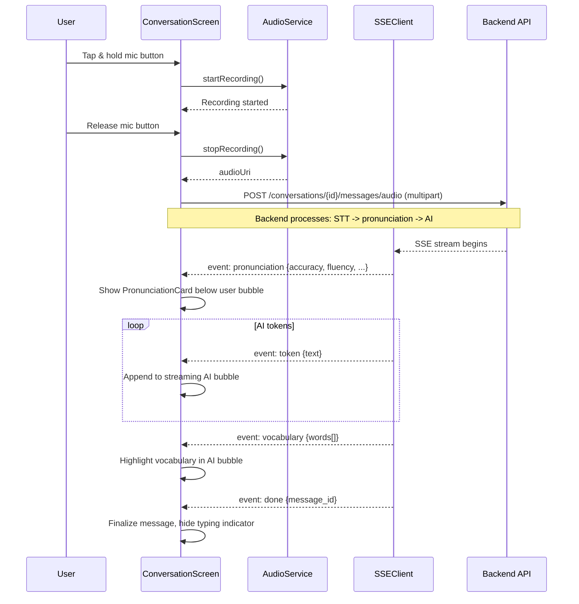
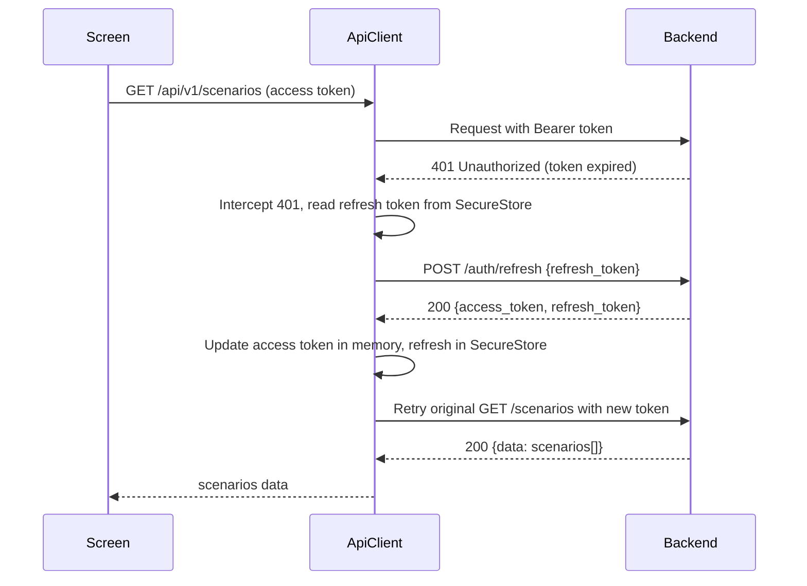

# Design -- mobile-app (sp-003)

> Sub-project: **mobile-app** | Stack: React Native + Expo + TypeScript
>
> Port: 8081 | Auth: JWT | Backend: `http://localhost:8000/api/v1`
>
> Architecture: Feature-based directory structure with shared services layer

---

## 1. Coding Principles

### 1.1 Universal Principles

| # | Principle | Enforcement |
|---|-----------|-------------|
| U1 | Same scenario, same pattern -- all API calls go through the shared `apiClient` Axios instance | Code review |
| U2 | One shared utility layer -- API client, error handler, storage, date utils | Single `services/` + `utils/` package |
| U3 | Prefer mature third-party libraries (`react-navigation`, `expo-av`, `expo-notifications`, `react-native-purchases`) | Dependency review |
| U4 | Every external SDK wrapped in a dedicated service; screen components never import SDK directly | Architecture lint |

### 1.2 Project-Specific Principles

| # | Spike | Principle |
|---|-------|-----------|
| PS1 | TS001 | AI dialog streaming consumed via `services/sseClient.ts`; screen components receive tokens through a React hook (`useSSEStream`) |
| PS2 | TS002 | Audio recording via `expo-av`; raw audio sent to backend speech proxy endpoint; mobile never calls Azure SDK directly |
| PS3 | TS002 | Speech service failure -> automatic fallback to text input mode; UI shows toast, enables text field, disables mic button |
| PS4 | TS003 | Subscription display status cached locally; all purchase operations go through `react-native-purchases` SDK wrapped in `services/purchaseService.ts` |
| PS5 | TS003 | Subscription status truth = backend (synced via RevenueCat webhook); client status is display cache only |
| PS6 | TS006 | Push notifications via `expo-notifications` wrapped in `services/pushService.ts`; token registration on login |
| PS7 | CN001 | Free-tier conversation limit enforced by backend (429 response); mobile displays remaining count and paywall UI |

_Source: forge-decisions.coding_principles_

---

## 2. Third-Party Integrations (Mobile)

| ID | Category | Package | Service Wrapper | Usage |
|----|----------|---------|-----------------|-------|
| TS001 | AI Streaming | N/A (EventSource polyfill) | `services/sseClient.ts` | Consume SSE token stream from backend conversation endpoints |
| TS002 | Audio | `expo-av` | `services/audioService.ts` | Record audio, send to backend `/conversations/{id}/messages/audio` |
| TS003 | Payment | `react-native-purchases` | `services/purchaseService.ts` | RevenueCat IAP/subscription management |
| TS005 | Realtime | `event-source-polyfill` | `services/sseClient.ts` | SSE connection with auth headers |
| TS006 | Push | `expo-notifications` | `services/pushService.ts` | Push token registration, notification handling |

_Source: forge-decisions.technical_spikes_

---

## 3. Navigation Stack

### 3.1 Navigator Hierarchy

```
RootNavigator (Stack)
  |
  +-- AuthStack (Stack) -- unauthenticated users
  |     +-- LoginScreen (S037)
  |     +-- RegisterScreen (S036) [DEFERRED]
  |     +-- ResetPasswordScreen (S039) [DEFERRED]
  |     +-- OnboardingScreen (S040) [DEFERRED]
  |
  +-- MainTabs (Bottom Tab Navigator) -- authenticated users
  |     +-- HomeTab (Stack)
  |     |     +-- HomeScreen (recommendations, quick actions)
  |     |     +-- ScenarioListScreen (S001)
  |     |     +-- ScenarioDetailScreen (S002)
  |     |
  |     +-- LearnTab (Stack)
  |     |     +-- ConversationScreen (S003) -- AI dialog + pronunciation
  |     |     +-- ConversationReportScreen (S004)
  |     |     +-- FreeConversationScreen (S005) [DEFERRED]
  |     |     +-- PronunciationReportScreen (S006) [DEFERRED]
  |     |
  |     +-- ReviewTab (Stack)
  |     |     +-- ReviewScreen (S007) -- spaced repetition cards
  |     |     +-- VocabularyScreen (S008) [DEFERRED]
  |     |
  |     +-- ProfileTab (Stack)
  |           +-- ProfileScreen (streak + achievements overview)
  |           +-- StreaksAchievementsScreen (S012)
  |           +-- LeaderboardScreen (S013) [DEFERRED]
  |           +-- PointsShopScreen (S014) [DEFERRED]
  |           +-- LearningProfileScreen (S016) [DEFERRED]
  |           +-- LearningStatsScreen (S017) [DEFERRED]
  |           +-- SettingsScreen (S038) [DEFERRED]
  |           +-- SubscriptionScreen (S020) [DEFERRED]
  |           +-- SubscriptionManageScreen (S021) [DEFERRED]
  |           +-- FeedbackScreen (S042) [DEFERRED]
  |
  +-- NotificationCenterScreen (S041) -- modal presentation
  +-- PaywallModal -- CN001 free-tier limit
  +-- ShareResultScreen (S015) [DEFERRED]
```

### 3.2 Navigation Types (TypeScript)

```typescript
// src/navigation/types.ts

export type RootStackParamList = {
  Auth: undefined;
  Main: undefined;
  NotificationCenter: undefined;
  Paywall: { source: 'conversation_limit' | 'feature_gate' };
};

export type AuthStackParamList = {
  Login: undefined;
  Register: undefined;          // [DEFERRED]
  ResetPassword: undefined;     // [DEFERRED]
  Onboarding: undefined;        // [DEFERRED]
};

export type HomeTabParamList = {
  Home: undefined;
  ScenarioList: { filter?: ScenarioFilter };
  ScenarioDetail: { scenarioId: string };
};

export type LearnTabParamList = {
  ConversationLanding: undefined;
  Conversation: { conversationId: string; scenarioId: string };
  ConversationReport: { conversationId: string };
};

export type ReviewTabParamList = {
  Review: undefined;
};

export type ProfileTabParamList = {
  Profile: undefined;
  StreaksAchievements: undefined;
};
```

### 3.3 Deep Linking Configuration

```typescript
// src/navigation/linking.ts

export const linking: LinkingOptions<RootStackParamList> = {
  prefixes: ['realtalk://', 'https://realtalk.app'],
  config: {
    screens: {
      Main: {
        screens: {
          HomeTab: {
            screens: {
              Home: 'home',
              ScenarioDetail: 'scenarios/:scenarioId',
            },
          },
          ReviewTab: {
            screens: {
              Review: 'reviews/today',
            },
          },
          ProfileTab: {
            screens: {
              StreaksAchievements: 'achievements',
            },
          },
        },
      },
      NotificationCenter: 'notifications',
    },
  },
};
```

---

## 4. Screen Components

### 4.1 HomeScreen

**Location**: `src/features/home/screens/HomeScreen.tsx`

**Component Tree**:
```
HomeScreen
  +-- SafeAreaView
       +-- ScrollView (refreshControl: pull-to-refresh)
            +-- HomeHeader (avatar, streak count, notification bell with badge)
            +-- RecommendationCarousel
            |     +-- FlatList (horizontal)
            |           +-- ScenarioCard[] (title, difficulty, reason, progress)
            +-- QuickActions (Continue Learning, Start New, Review Due)
            +-- DailyProgress (conversations today, review count, streak)
```

**State**:
- `recommendations: RecommendationDTO[]` -- from `GET /api/v1/recommendations`
- `streak: StreakDTO` -- from `GET /api/v1/streaks/me`
- `reviewSummary: ReviewSummary` -- from `GET /api/v1/reviews/summary`
- `isLoading: boolean`
- `isOffline: boolean`

**API Calls**:
- `GET /api/v1/recommendations` -- personalized scenario list
- `GET /api/v1/streaks/me` -- current streak
- `GET /api/v1/reviews/summary` -- due card count

**UI States**: loading (skeleton), data (normal), empty (new user), error (retry), offline (cached + banner)

_Source: T020, T013, T007, Home screen_

---

### 4.2 ScenarioListScreen (S001)

**Location**: `src/features/scenarios/screens/ScenarioListScreen.tsx`

**Component Tree**:
```
ScenarioListScreen
  +-- SafeAreaView
       +-- FilterBar (difficulty chips, tag dropdown)
       +-- FlatList (virtualized, paginated)
       |     +-- ScenarioListItem[] (thumbnail, title, difficulty badge, tags, progress)
       +-- EmptyState (if no results)
```

**State**:
- `scenarios: ScenarioListItem[]` -- from `GET /api/v1/scenarios`
- `filters: ScenarioFilter` -- { difficulty?, tag_id?, page, size }
- `isLoading: boolean`
- `isRefreshing: boolean`
- `hasMore: boolean`

**API Calls**:
- `GET /api/v1/scenarios?difficulty={}&tag_id={}&page={}&size=20`

**Pagination**: Infinite scroll via `onEndReached` with `page` incrementing.

**UI States**: loading (skeleton list), data (scrollable list), empty (illustrated empty), error (retry), offline (cached)

_Source: T001, S001_

---

### 4.3 ScenarioDetailScreen (S002)

**Location**: `src/features/scenarios/screens/ScenarioDetailScreen.tsx`

**Component Tree**:
```
ScenarioDetailScreen
  +-- ScrollView
       +-- ScenarioHeader (title, difficulty, cover image)
       +-- ScenarioMeta (target roles, tags, estimated duration)
       +-- DialoguePreview (first 3 dialogue nodes, expandable)
       +-- UserProgress (last score, attempts count) -- if previously attempted
       +-- StartPracticeButton (CTA, full width)
            -- onPress: POST /api/v1/conversations {scenario_id}
```

**State**:
- `scenario: ScenarioDetail` -- from `GET /api/v1/scenarios/{id}`
- `isLoading: boolean`
- `isStarting: boolean` -- loading state for conversation creation

**API Calls**:
- `GET /api/v1/scenarios/{id}` -- scenario detail
- `POST /api/v1/conversations` -- create conversation (on CTA tap)

**Error Handling**:
- 429 on conversation creation -> open Paywall modal
- 404 on scenario -> show "Scenario no longer available" with back navigation

_Source: T001, T002, S002, CN001_

---

### 4.4 ConversationScreen (S003)

**Location**: `src/features/conversation/screens/ConversationScreen.tsx`

**Component Tree**:
```
ConversationScreen
  +-- SafeAreaView
       +-- ConversationHeader (scenario title, remaining conversations badge, end button)
       +-- MessageList (FlatList, inverted)
       |     +-- MessageBubble[] (user | ai)
       |     |     +-- TextContent (with vocabulary highlights)
       |     |     +-- PronunciationCard (if audio message, embedded)
       |     |     |     +-- ScoreBar (accuracy, fluency, completeness, prosody)
       |     |     |     +-- PhonemeDetail (expandable, tap-to-hear)
       |     +-- TypingIndicator (during AI streaming)
       +-- InputBar
             +-- TextInput (auto-focused on speech fallback)
             +-- MicrophoneButton (press-and-hold to record)
             +-- SendButton
```

**State**:
- `messages: ConversationMessage[]` -- local state, appended via SSE
- `isStreaming: boolean` -- AI response in progress
- `isRecording: boolean` -- audio recording active
- `streamingText: string` -- current AI response being built token-by-token
- `pronunciationResult: PronunciationResult | null` -- latest pronunciation feedback
- `isFallbackToText: boolean` -- speech service unavailable
- `conversationId: string`

**SSE Integration** (via `useSSEStream` hook):
```typescript
// Pseudo-code for SSE consumption
const { startStream, stopStream } = useSSEStream({
  onToken: (text) => appendToStreamingText(text),
  onPronunciation: (result) => setPronunciationResult(result),
  onVocabulary: (words) => highlightVocabulary(words),
  onDone: (messageId) => finalizeMessage(messageId),
  onError: (error) => handleStreamError(error),
});
```

**Audio Recording** (via `useAudioRecorder` hook):
```typescript
// Pseudo-code for audio recording
const { startRecording, stopRecording, audioUri } = useAudioRecorder({
  onPermissionDenied: () => setFallbackToText(true),
  format: Audio.RecordingOptionsPresets.HIGH_QUALITY,
});
```

**API Calls**:
- `POST /api/v1/conversations/{id}/messages` -- send text (SSE response)
- `POST /api/v1/conversations/{id}/messages/audio` -- send audio (SSE response with pronunciation)
- `POST /api/v1/conversations/{id}/complete` -- end conversation

**UI States**: streaming (typing indicator + token build-up), recording (waveform animation), idle (input ready), fallback-text (mic disabled), error (reconnecting banner)

_Source: T002, T005, S003, TS001, TS002, TS005, CN001_

---

### 4.5 ConversationReportScreen (S004)

**Location**: `src/features/conversation/screens/ConversationReportScreen.tsx`

**Component Tree**:
```
ConversationReportScreen
  +-- ScrollView
       +-- OverallScore (circular progress indicator, large number)
       +-- ScoreBreakdown (grammar, expression, pronunciation summaries)
       +-- GrammarErrorList
       |     +-- GrammarErrorItem[] (expandable: original, correction, explanation)
       +-- ExpressionSuggestionList
       |     +-- SuggestionItem[] (original, suggested, reason)
       +-- BasicStats (duration, message count, word count)
       +-- ActionButtons
             +-- PracticeAgainButton (-> create new conversation for same scenario)
             +-- ShareButton (-> generate shareable image)
             +-- BackToHomeButton
```

**State**:
- `report: ConversationReport` -- from `GET /api/v1/conversations/{id}/report`
- `isLoading: boolean`
- `isScoreAvailable: boolean` -- false if AI scoring failed

**API Calls**:
- `GET /api/v1/conversations/{id}/report`
- `POST /api/v1/conversations` -- (on "Practice Again")

**UI States**: loading (skeleton), full-report (all sections), fallback (basic stats only), error (retry)

_Source: T003, S004_

---

### 4.6 ReviewScreen (S007)

**Location**: `src/features/review/screens/ReviewScreen.tsx`

**Component Tree**:
```
ReviewScreen
  +-- SafeAreaView
       +-- ReviewHeader (due count, progress bar)
       +-- CardStack (animated card flip/swipe)
       |     +-- ReviewCard
       |           +-- CardFront (word, tap to flip)
       |           +-- CardBack (definition, example sentence, source conversation)
       +-- RatingButtons (Again, Hard, Good, Easy)
       +-- CompletionSummary (shown when all cards done)
             +-- StatsRow (reviewed, retention rate)
             +-- ConfettiAnimation
             +-- NextReviewDate
```

**State**:
- `cards: ReviewCardDTO[]` -- from `GET /api/v1/reviews/today`
- `currentIndex: number`
- `isFlipped: boolean`
- `isCompleted: boolean`
- `summary: ReviewSummary | null`

**API Calls**:
- `GET /api/v1/reviews/today` -- fetch due cards
- `POST /api/v1/reviews/{card_id}/rate` -- submit rating
- `GET /api/v1/reviews/summary` -- fetch completion summary

**UI States**: loading (skeleton card), reviewing (card stack), empty (all caught up), completed (summary + confetti), error (retry)

_Source: T007, S007, TS004_

---

### 4.7 StreaksAchievementsScreen (S012)

**Location**: `src/features/gamification/screens/StreaksAchievementsScreen.tsx`

**Component Tree**:
```
StreaksAchievementsScreen
  +-- ScrollView
       +-- StreakSection
       |     +-- StreakCounter (large animated number)
       |     +-- StreakRecord (longest streak)
       |     +-- CalendarHeatmap (last 30 days activity)
       |     +-- RestoreStreakButton (disabled if !can_restore)
       +-- AchievementSection
             +-- SectionHeader ("Achievements")
             +-- AchievementGrid (FlatList, numColumns=3)
                   +-- AchievementBadge[] (icon, name, earned/locked state)
```

**State**:
- `streak: StreakDTO` -- from `GET /api/v1/streaks/me`
- `achievements: AchievementDTO[]` -- from `GET /api/v1/achievements`
- `isRestoring: boolean`

**API Calls**:
- `GET /api/v1/streaks/me`
- `GET /api/v1/achievements`
- `POST /api/v1/streaks/restore`

**UI States**: loading (skeleton), data (streak + badges), error (retry)

_Source: T013, S012, CN004_

---

### 4.8 LoginScreen (S037)

**Location**: `src/features/auth/screens/LoginScreen.tsx`

**Component Tree**:
```
LoginScreen
  +-- KeyboardAvoidingView
       +-- Logo + AppName
       +-- EmailInput (TextInput, keyboardType: email-address)
       +-- PasswordInput (TextInput, secureTextEntry, show/hide toggle)
       +-- LoginButton (disabled while submitting)
       +-- ForgotPasswordLink [DEFERRED -- navigates to ResetPassword]
       +-- RegisterLink [DEFERRED -- navigates to Register]
       +-- ErrorMessage (inline, below form)
```

**State**:
- `email: string`
- `password: string`
- `isSubmitting: boolean`
- `error: string | null`

**API Calls**:
- `POST /api/v1/auth/login` -- { email, password }

**Post-Login Flow**:
1. Store refresh token in `expo-secure-store`
2. Store access token in memory (Axios default header)
3. Register push token via `pushService.registerToken()`
4. Navigate to Main stack

**UI States**: idle (form ready), submitting (button loading), error (inline message), banned (modal with reason)

_Source: T039, S037_

---

### 4.9 NotificationCenterScreen (S041)

**Location**: `src/features/notifications/screens/NotificationCenterScreen.tsx`

**Component Tree**:
```
NotificationCenterScreen (Modal presentation)
  +-- SafeAreaView
       +-- Header ("Notifications", close button, unread count badge)
       +-- FlatList (virtualized)
       |     +-- NotificationItem[] (icon by type, title, body, time, read/unread indicator)
       +-- EmptyState ("No notifications yet")
```

**State**:
- `notifications: NotificationDTO[]` -- from `GET /api/v1/notifications`
- `unreadCount: number`
- `isLoading: boolean`

**API Calls**:
- `GET /api/v1/notifications?page={}&size=20`
- `PATCH /api/v1/notifications/{id}/read`

**UI States**: loading (skeleton list), data (notification list), empty (illustrated), error (retry)

_Source: T044, S041_

---

## 5. API Client Setup

### 5.1 Axios Instance

```typescript
// src/services/apiClient.ts

import axios, { AxiosInstance, InternalAxiosRequestConfig } from 'axios';
import * as SecureStore from 'expo-secure-store';

const API_BASE_URL = __DEV__
  ? 'http://localhost:8000/api/v1'
  : 'https://api.realtalk.app/api/v1';

let accessToken: string | null = null;

export const setAccessToken = (token: string | null) => {
  accessToken = token;
};

export const apiClient: AxiosInstance = axios.create({
  baseURL: API_BASE_URL,
  timeout: 30000,
  headers: { 'Content-Type': 'application/json' },
});

// Request interceptor: attach access token
apiClient.interceptors.request.use((config: InternalAxiosRequestConfig) => {
  if (accessToken) {
    config.headers.Authorization = `Bearer ${accessToken}`;
  }
  return config;
});

// Response interceptor: auto-refresh on 401
apiClient.interceptors.response.use(
  (response) => response,
  async (error) => {
    const originalRequest = error.config;
    if (error.response?.status === 401 && !originalRequest._retry) {
      originalRequest._retry = true;
      const refreshToken = await SecureStore.getItemAsync('refreshToken');
      if (refreshToken) {
        try {
          const { data } = await axios.post(`${API_BASE_URL}/auth/refresh`, {
            refresh_token: refreshToken,
          });
          setAccessToken(data.data.access_token);
          await SecureStore.setItemAsync('refreshToken', data.data.refresh_token);
          originalRequest.headers.Authorization = `Bearer ${data.data.access_token}`;
          return apiClient(originalRequest);
        } catch {
          // Refresh failed -- force logout
          await SecureStore.deleteItemAsync('refreshToken');
          setAccessToken(null);
          // Navigate to login (via event emitter or navigation ref)
        }
      }
    }
    return Promise.reject(error);
  }
);
```

### 5.2 SSE Client

```typescript
// src/services/sseClient.ts

import EventSource from 'event-source-polyfill';

interface SSECallbacks {
  onToken: (text: string) => void;
  onPronunciation: (result: PronunciationResult) => void;
  onVocabulary: (words: VocabularyWord[]) => void;
  onDone: (messageId: string) => void;
  onError: (error: Error) => void;
}

export function createSSEConnection(
  url: string,
  token: string,
  callbacks: SSECallbacks
): EventSource {
  const eventSource = new EventSource(url, {
    headers: { Authorization: `Bearer ${token}` },
  });

  eventSource.addEventListener('token', (e: MessageEvent) => {
    callbacks.onToken(JSON.parse(e.data).text);
  });

  eventSource.addEventListener('pronunciation', (e: MessageEvent) => {
    callbacks.onPronunciation(JSON.parse(e.data));
  });

  eventSource.addEventListener('vocabulary', (e: MessageEvent) => {
    callbacks.onVocabulary(JSON.parse(e.data).words);
  });

  eventSource.addEventListener('done', (e: MessageEvent) => {
    callbacks.onDone(JSON.parse(e.data).message_id);
    eventSource.close();
  });

  eventSource.onerror = (error: Event) => {
    callbacks.onError(new Error('SSE connection error'));
    eventSource.close();
  };

  return eventSource;
}
```

---

## 6. Offline Strategy

### 6.1 AsyncStorage Schema

| Key | Value Type | TTL | Source |
|-----|-----------|-----|--------|
| `@scenarios_cache` | `{ items: ScenarioListItem[], fetchedAt: number }` | 5 min | `GET /api/v1/scenarios` |
| `@scenario_{id}` | `ScenarioDetail` | 1 hour | `GET /api/v1/scenarios/{id}` |
| `@recommendations_cache` | `{ items: RecommendationDTO[], fetchedAt: number }` | 1 hour | `GET /api/v1/recommendations` |
| `@report_{conversationId}` | `ConversationReport` | Permanent | `GET /api/v1/conversations/{id}/report` |
| `@review_cards_today` | `ReviewCardDTO[]` | Until next day | `GET /api/v1/reviews/today` |
| `@streak_cache` | `StreakDTO` | 30 min | `GET /api/v1/streaks/me` |
| `@achievements_cache` | `AchievementDTO[]` | 1 hour | `GET /api/v1/achievements` |
| `@notifications_cache` | `NotificationDTO[]` (last 20) | 15 min | `GET /api/v1/notifications` |
| `@user_profile` | `UserProfile` | 1 hour | Derived from auth |
| `@pending_actions` | `PendingAction[]` | Until synced | Offline queue |

### 6.2 Offline Action Queue

```typescript
// src/services/offlineQueue.ts

interface PendingAction {
  id: string;
  type: 'rate_card' | 'mark_notification_read';
  endpoint: string;
  method: 'POST' | 'PATCH';
  body: Record<string, unknown>;
  createdAt: number;
  retryCount: number;
}

// On network restore (via NetInfo listener), drain the queue:
// 1. Read @pending_actions from AsyncStorage
// 2. Execute each action in order
// 3. Remove successful actions
// 4. Retry failed actions (max 3 retries)
```

### 6.3 Network Status

Use `@react-native-community/netinfo` to detect connectivity changes. Display a persistent banner at the top of the screen when offline. Auto-trigger queue sync on reconnection.

---

## 7. Push Notification Setup

### 7.1 Registration Flow

```
App Launch
  |
  +-- User logs in successfully
  |     |
  |     +-- Request push permission (expo-notifications)
  |     |     |
  |     |     +-- Granted: get Expo push token
  |     |     |     |
  |     |     |     +-- Send token to backend
  |     |     |           PUT /api/v1/notifications/settings
  |     |     |           (body includes expo_push_token)
  |     |     |
  |     |     +-- Denied: skip, use in-app notifications only
  |     |
  |     +-- Set up notification listeners
           |
           +-- Foreground: show in-app banner (custom component)
           +-- Background tap: extract deep-link data, navigate
           +-- Killed state tap: extract deep-link data via initial notification
```

### 7.2 Push Service

```typescript
// src/services/pushService.ts

import * as Notifications from 'expo-notifications';
import { apiClient } from './apiClient';
import { Platform } from 'react-native';

// Configure notification behavior
Notifications.setNotificationHandler({
  handleNotification: async () => ({
    shouldShowAlert: true,  // Show in-app banner
    shouldPlaySound: true,
    shouldSetBadge: true,
  }),
});

export async function registerForPushNotifications(): Promise<string | null> {
  const { status: existing } = await Notifications.getPermissionsAsync();
  let finalStatus = existing;

  if (existing !== 'granted') {
    const { status } = await Notifications.requestPermissionsAsync();
    finalStatus = status;
  }

  if (finalStatus !== 'granted') {
    return null;
  }

  const tokenData = await Notifications.getExpoPushTokenAsync({
    projectId: 'your-expo-project-id',
  });

  // Send token to backend
  await apiClient.put('/notifications/settings', {
    expo_push_token: tokenData.data,
    platform: Platform.OS,
  });

  return tokenData.data;
}
```

### 7.3 Notification Types and Deep Links

| Notification Type | Deep Link | Target Screen |
|-------------------|-----------|---------------|
| `review_reminder` | `realtalk://reviews/today` | ReviewScreen (S007) |
| `achievement` | `realtalk://achievements` | StreaksAchievementsScreen (S012) |
| `system` | `realtalk://notifications` | NotificationCenterScreen (S041) |
| `conversation_report` | `realtalk://conversations/{id}/report` | ConversationReportScreen (S004) |

---

## 8. Audio Recording Integration

### 8.1 Audio Service

```typescript
// src/services/audioService.ts

import { Audio } from 'expo-av';

export class AudioService {
  private recording: Audio.Recording | null = null;

  async requestPermission(): Promise<boolean> {
    const { granted } = await Audio.requestPermissionsAsync();
    return granted;
  }

  async startRecording(): Promise<void> {
    await Audio.setAudioModeAsync({
      allowsRecordingIOS: true,
      playsInSilentModeIOS: true,
    });
    const { recording } = await Audio.Recording.createAsync(
      Audio.RecordingOptionsPresets.HIGH_QUALITY
    );
    this.recording = recording;
  }

  async stopRecording(): Promise<string | null> {
    if (!this.recording) return null;
    await this.recording.stopAndUnloadAsync();
    await Audio.setAudioModeAsync({ allowsRecordingIOS: false });
    const uri = this.recording.getURI();
    this.recording = null;
    return uri;
  }

  async uploadAudio(conversationId: string, audioUri: string): Promise<void> {
    const formData = new FormData();
    formData.append('audio', {
      uri: audioUri,
      type: 'audio/wav',
      name: 'recording.wav',
    } as any);

    // This triggers SSE response -- handled by sseClient
    await apiClient.post(
      `/conversations/${conversationId}/messages/audio`,
      formData,
      { headers: { 'Content-Type': 'multipart/form-data' } }
    );
  }
}
```

### 8.2 useAudioRecorder Hook

```typescript
// src/features/conversation/hooks/useAudioRecorder.ts

export function useAudioRecorder() {
  const [isRecording, setIsRecording] = useState(false);
  const [hasPermission, setHasPermission] = useState<boolean | null>(null);
  const audioService = useRef(new AudioService()).current;

  const checkPermission = useCallback(async () => {
    const granted = await audioService.requestPermission();
    setHasPermission(granted);
    return granted;
  }, []);

  const startRecording = useCallback(async () => {
    if (!hasPermission) {
      const granted = await checkPermission();
      if (!granted) return false;
    }
    await audioService.startRecording();
    setIsRecording(true);
    return true;
  }, [hasPermission]);

  const stopRecording = useCallback(async () => {
    setIsRecording(false);
    return audioService.stopRecording();
  }, []);

  return { isRecording, hasPermission, startRecording, stopRecording };
}
```

---

## 9. SSE Streaming Integration

### 9.1 useSSEStream Hook

```typescript
// src/features/conversation/hooks/useSSEStream.ts

export function useSSEStream(conversationId: string) {
  const [isStreaming, setIsStreaming] = useState(false);
  const [streamingText, setStreamingText] = useState('');
  const eventSourceRef = useRef<EventSource | null>(null);

  const sendTextMessage = useCallback(async (content: string) => {
    setIsStreaming(true);
    setStreamingText('');

    const url = `${API_BASE_URL}/conversations/${conversationId}/messages`;
    // POST the message body first, then connect SSE for response
    // The backend returns SSE stream directly from the POST endpoint
    eventSourceRef.current = createSSEConnection(
      url,
      accessToken!,
      {
        onToken: (text) => setStreamingText((prev) => prev + text),
        onPronunciation: (result) => { /* update pronunciation state */ },
        onVocabulary: (words) => { /* highlight vocabulary */ },
        onDone: (messageId) => {
          setIsStreaming(false);
          // Finalize message in local state
        },
        onError: (error) => {
          setIsStreaming(false);
          // Show error toast
        },
      }
    );
  }, [conversationId]);

  // Cleanup on unmount
  useEffect(() => {
    return () => {
      eventSourceRef.current?.close();
    };
  }, []);

  return { isStreaming, streamingText, sendTextMessage };
}
```

---

## 10. Directory Structure

```
apps/mobile-app/
  src/
    app/
      App.tsx                           -- Root component, providers, navigation container
      providers.tsx                     -- AuthProvider, ThemeProvider, NetworkProvider
    navigation/
      RootNavigator.tsx                 -- Auth vs Main stack switching
      MainTabNavigator.tsx              -- Bottom tabs (Home, Learn, Review, Profile)
      HomeStack.tsx                     -- Home tab nested stack
      LearnStack.tsx                    -- Learn tab nested stack
      ReviewStack.tsx                   -- Review tab nested stack
      ProfileStack.tsx                  -- Profile tab nested stack
      types.ts                         -- TypeScript param list types
      linking.ts                       -- Deep link configuration
    features/
      auth/
        screens/
          LoginScreen.tsx              -- S037
        hooks/
          useAuth.ts                   -- login, logout, token management
        services/
          authService.ts               -- API calls for auth endpoints
      home/
        screens/
          HomeScreen.tsx               -- Home tab root
        components/
          RecommendationCarousel.tsx
          QuickActions.tsx
          DailyProgress.tsx
      scenarios/
        screens/
          ScenarioListScreen.tsx        -- S001
          ScenarioDetailScreen.tsx      -- S002
        components/
          ScenarioCard.tsx
          ScenarioListItem.tsx
          FilterBar.tsx
          DialoguePreview.tsx
        hooks/
          useScenarios.ts
        services/
          scenarioService.ts            -- API calls for scenario endpoints
      conversation/
        screens/
          ConversationScreen.tsx         -- S003
          ConversationReportScreen.tsx   -- S004
        components/
          MessageBubble.tsx
          PronunciationCard.tsx
          ScoreBar.tsx
          PhonemeDetail.tsx
          TypingIndicator.tsx
          InputBar.tsx
          MicrophoneButton.tsx
        hooks/
          useSSEStream.ts
          useAudioRecorder.ts
          useConversation.ts
        services/
          conversationService.ts        -- API calls for conversation endpoints
      review/
        screens/
          ReviewScreen.tsx              -- S007
        components/
          ReviewCard.tsx
          CardStack.tsx
          RatingButtons.tsx
          CompletionSummary.tsx
        hooks/
          useReview.ts
        services/
          reviewService.ts              -- API calls for review endpoints
      gamification/
        screens/
          StreaksAchievementsScreen.tsx  -- S012
        components/
          StreakCounter.tsx
          CalendarHeatmap.tsx
          AchievementGrid.tsx
          AchievementBadge.tsx
          RestoreStreakButton.tsx
        hooks/
          useStreak.ts
          useAchievements.ts
        services/
          streakService.ts              -- API calls for streak endpoints
          achievementService.ts
      notifications/
        screens/
          NotificationCenterScreen.tsx  -- S041
        components/
          NotificationItem.tsx
        hooks/
          useNotifications.ts
        services/
          notificationService.ts        -- API calls for notification endpoints
    services/
      apiClient.ts                      -- Axios instance + interceptors
      sseClient.ts                      -- EventSource wrapper
      audioService.ts                   -- expo-av recording wrapper
      pushService.ts                    -- expo-notifications wrapper
      purchaseService.ts                -- react-native-purchases wrapper [DEFERRED]
      offlineQueue.ts                   -- Pending action queue
      storageService.ts                 -- AsyncStorage helpers with TTL
    types/
      api.ts                            -- Backend DTO types (mirroring backend schemas)
      navigation.ts                     -- Re-export from navigation/types.ts
      common.ts                         -- Shared utility types
    utils/
      format.ts                         -- Date, number, score formatting
      validators.ts                     -- Email, password validation
      constants.ts                      -- App-wide constants (colors, sizes, keys)
    theme/
      colors.ts
      typography.ts
      spacing.ts
      index.ts                          -- Unified theme export
    assets/
      images/                           -- Static images, illustrations
      animations/                       -- Lottie files (confetti, loading)
  app.json                              -- Expo configuration
  tsconfig.json
  babel.config.js
  package.json
  .env.example
```

---

## 11. Key Sequence Diagrams

### 11.1 Conversation with Voice Input



### 11.2 Token Refresh Flow


